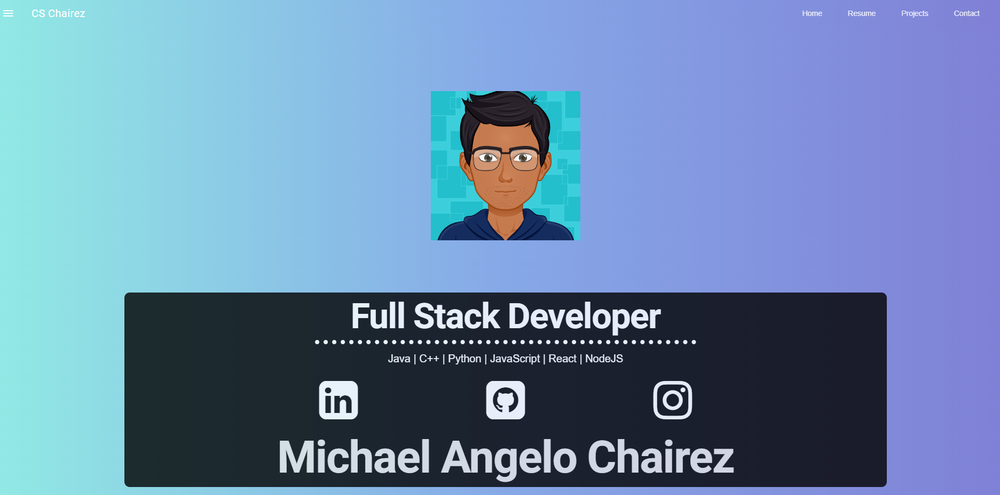

# Portfolio Website

This project was bootstrapped with [Create React App](https://github.com/facebook/create-react-app). Running with [Firebase](https://firebase.google.com/) support on the backend.
This website displays my resume, projects, and links to my LinkedIn and GitHub

## Available Scripts

In the project directory, you can run:

 `npm start`
Runs the app in the development mode. 

Or view it here: [Portfolio Site](https://portfolio-e7816.firebaseapp.com/)

----------------
# Landing Page

